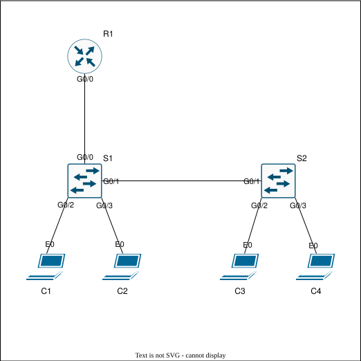

# Lab Guide — Router-on-a-Stick

## Overview

This lab demonstrates how to configure and verify Router-on-a-Stick inter-VLAN routing.

Router-on-a-Stick uses router subinterfaces and 802.1Q encapsulation to route between VLANs over a single physical router interface. In this lab, VLAN 10 and VLAN 20 are extended across two switches, and R1 provides the default gateway for each VLAN.

This lab validates VLAN creation, trunk configuration, router subinterfaces, inter-VLAN routing, access-port assignment, and end-to-end host connectivity.

**Lab Status:** Validated

**End-to-End Verification:** Successful

**CML VLAN Export Note:** Cisco CML topology exports and exported device configuration files may not preserve VLAN database state. VLAN IDs, VLAN names, and intended VLAN design are documented in this README and should not be inferred from "topology.yaml" or exported configs alone.

---

## Objectives

* [x] Create VLAN 10 and VLAN 20.
* [x] Configure access ports for VLAN 10 and VLAN 20.
* [x] Configure 802.1Q trunks between switches and the router.
* [x] Configure router subinterfaces for inter-VLAN routing.
* [x] Verify connected routes on the router.
* [x] Verify VLAN and trunk behavior on the switches.
* [x] Verify end-to-end inter-VLAN connectivity.
* [x] Capture selected ICMP traffic for packet-level validation.

---

## Topology

The topology uses one router, two Layer 2 switches, and four clients. R1 routes between VLAN 10 and VLAN 20 using subinterfaces on a single physical trunk connection to S1.



---

## Addressing Tables

### Router Interfaces

| Device | Interface | IP Address      | VLAN  | Description                          |
| ------ | --------- | --------------- | ----- | ------------------------------------ |
| R1     | G0/0      | Unassigned      | Trunk | Physical Router-on-a-Stick interface |
| R1     | G0/0.10   | 192.168.10.1/24 | 10    | Default gateway for VLAN 10          |
| R1     | G0/0.20   | 192.168.20.1/24 | 20    | Default gateway for VLAN 20          |

### Switch Links

| Local Device | Local Interface | Peer Device | Peer Interface | Mode   | Description             |
| ------------ | --------------- | ----------- | -------------- | ------ | ----------------------- |
| S1           | G0/0            | R1          | G0/0           | Trunk  | Router-on-a-Stick trunk |
| S1           | G0/1            | S2          | G0/1           | Trunk  | Interswitch trunk       |
| S1           | G0/2            | C1          | eth0           | Access | VLAN 10 client          |
| S1           | G0/3            | C2          | eth0           | Access | VLAN 20 client          |
| S2           | G0/1            | S1          | G0/1           | Trunk  | Interswitch trunk       |
| S2           | G0/2            | C3          | eth0           | Access | VLAN 10 client          |
| S2           | G0/3            | C4          | eth0           | Access | VLAN 20 client          |

### Client Addressing

| Client | Interface | IP Address      | Default Gateway | VLAN |
| ------ | --------- | --------------- | --------------- | ---- |
| C1     | eth0      | 192.168.10.2/24 | 192.168.10.1    | 10   |
| C2     | eth0      | 192.168.20.2/24 | 192.168.20.1    | 20   |
| C3     | eth0      | 192.168.10.3/24 | 192.168.10.1    | 10   |
| C4     | eth0      | 192.168.20.3/24 | 192.168.20.1    | 20   |

### VLANs

| VLAN | Name     | Subnet          |
| ---- | -------- | --------------- |
| 10   | USERS_10 | 192.168.10.0/24 |
| 20   | USERS_20 | 192.168.20.0/24 |

---

## Configuration Steps

### Step 1 — Router-on-a-Stick Configuration

**Note:** The CLI examples below are annotated for readability. Clean device configurations are available in [`configs/`](configs/).

**R1**

```bash
# R1 Configuration Block
enable # Enters privileged EXEC mode.
configure terminal # Enters global configuration mode.
hostname R1 # Sets hostname to R1.

interface gigabitEthernet0/0 # Targets the physical trunk interface.
no shutdown # Enables the physical interface.

interface gigabitEthernet0/0.10 # Creates and targets the VLAN 10 subinterface.
encapsulation dot1Q 10 # Enables 802.1Q encapsulation for VLAN 10.
ip address 192.168.10.1 255.255.255.0 # Sets the VLAN 10 default gateway.

interface gigabitEthernet0/0.20 # Creates and targets the VLAN 20 subinterface.
encapsulation dot1Q 20 # Enables 802.1Q encapsulation for VLAN 20.
ip address 192.168.20.1 255.255.255.0 # Sets the VLAN 20 default gateway.

end # Returns to privileged EXEC mode.
write memory # Saves the running configuration.
```

---

### Step 2 — Switch Configuration

**Design note:** VLANs 10 and 20 are created on both switches. Access ports connect to clients, while trunk ports carry VLAN 10 and VLAN 20 between S1, S2, and R1.

**Native VLAN note:** The native VLAN is explicitly set to VLAN 1 on trunk links as a documentation and consistency reminder. The routed VLANs in this lab are VLAN 10 and VLAN 20.

**S1**

```bash
# S1 Configuration Block
enable # Enters privileged EXEC mode.
configure terminal # Enters global configuration mode.
hostname S1 # Sets hostname to S1.

vlan 10 # Creates VLAN 10.
name USERS_10 # Names VLAN 10.

vlan 20 # Creates VLAN 20.
name USERS_20 # Names VLAN 20.

interface gigabitEthernet0/2 # Targets client-facing access port for C1.
switchport mode access # Sets interface to access mode.
switchport access vlan 10 # Assigns the interface to VLAN 10.
spanning-tree portfast edge # Enables PortFast edge behavior on the access port.
spanning-tree bpduguard enable # Protects the access port from unexpected BPDUs.

interface gigabitEthernet0/3 # Targets client-facing access port for C2.
switchport mode access # Sets interface to access mode.
switchport access vlan 20 # Assigns the interface to VLAN 20.
spanning-tree portfast edge # Enables PortFast edge behavior on the access port.
spanning-tree bpduguard enable # Protects the access port from unexpected BPDUs.

interface gigabitEthernet0/1 # Targets the trunk link to S2.
switchport trunk encapsulation dot1q # Sets 802.1Q trunk encapsulation.
switchport mode trunk # Sets interface to trunk mode.
switchport trunk allowed vlan 10,20 # Allows VLANs 10 and 20 on the trunk.
switchport trunk native vlan 1 # Explicitly documents native VLAN 1.

interface gigabitEthernet0/0 # Targets the trunk link to R1.
switchport trunk encapsulation dot1q # Sets 802.1Q trunk encapsulation.
switchport mode trunk # Sets interface to trunk mode.
switchport trunk allowed vlan 10,20 # Allows VLANs 10 and 20 on the trunk.
switchport trunk native vlan 1 # Explicitly documents native VLAN 1.

end # Returns to privileged EXEC mode.
write memory # Saves the running configuration.
```

**S2**

```bash
# S2 Configuration Block
enable # Enters privileged EXEC mode.
configure terminal # Enters global configuration mode.
hostname S2 # Sets hostname to S2.

vlan 10 # Creates VLAN 10.
name USERS_10 # Names VLAN 10.

vlan 20 # Creates VLAN 20.
name USERS_20 # Names VLAN 20.

interface gigabitEthernet0/2 # Targets client-facing access port for C3.
switchport mode access # Sets interface to access mode.
switchport access vlan 10 # Assigns the interface to VLAN 10.
spanning-tree portfast edge # Enables PortFast edge behavior on the access port.
spanning-tree bpduguard enable # Protects the access port from unexpected BPDUs.

interface gigabitEthernet0/3 # Targets client-facing access port for C4.
switchport mode access # Sets interface to access mode.
switchport access vlan 20 # Assigns the interface to VLAN 20.
spanning-tree portfast edge # Enables PortFast edge behavior on the access port.
spanning-tree bpduguard enable # Protects the access port from unexpected BPDUs.

interface gigabitEthernet0/1 # Targets the trunk link to S1.
switchport trunk encapsulation dot1q # Sets 802.1Q trunk encapsulation.
switchport mode trunk # Sets interface to trunk mode.
switchport trunk allowed vlan 10,20 # Allows VLANs 10 and 20 on the trunk.
switchport trunk native vlan 1 # Explicitly documents native VLAN 1.

end # Returns to privileged EXEC mode.
write memory # Saves the running configuration.
```

---

## Verification

See [`verification/verification_commands.md`](verification/verification_commands.md) for recorded command output.

### R1 Verification

```bash
# R1 Verification Block
show ip interface brief # Confirm physical interface and subinterfaces are up/up.
show interfaces gigabitEthernet0/0.10 # Confirm VLAN 10 encapsulation and IP addressing.
show interfaces gigabitEthernet0/0.20 # Confirm VLAN 20 encapsulation and IP addressing.
show running-config interface gigabitEthernet0/0.10 # Confirm VLAN 10 subinterface configuration.
show running-config interface gigabitEthernet0/0.20 # Confirm VLAN 20 subinterface configuration.
show ip route # Confirm connected routes for VLAN 10 and VLAN 20.
show arp # Confirm ARP entries for clients in both VLANs.
```

### S1 Verification

```bash
# S1 Verification Block
show ip interface brief # Confirm expected switch interfaces are up/up.
show vlan brief # Confirm VLAN 10 and VLAN 20 exist and access ports are assigned correctly.
show spanning-tree summary # Confirm VLANs are active and forwarding.
show running-config interface gigabitEthernet0/0 # Confirm trunk configuration toward R1.
show running-config interface gigabitEthernet0/1 # Confirm trunk configuration toward S2.
show running-config interface gigabitEthernet0/2 # Confirm VLAN 10 access-port configuration.
show running-config interface gigabitEthernet0/3 # Confirm VLAN 20 access-port configuration.
show interfaces switchport # Confirm access/trunk modes, VLAN assignments, and 802.1Q behavior.
```

### S2 Verification

```bash
# S2 Verification Block
show ip interface brief # Confirm expected switch interfaces are up/up.
show vlan brief # Confirm VLAN 10 and VLAN 20 exist and access ports are assigned correctly.
show spanning-tree summary # Confirm VLANs are active and forwarding.
show running-config interface gigabitEthernet0/1 # Confirm trunk configuration toward S1.
show running-config interface gigabitEthernet0/2 # Confirm VLAN 10 access-port configuration.
show running-config interface gigabitEthernet0/3 # Confirm VLAN 20 access-port configuration.
show interfaces switchport # Confirm access/trunk modes, VLAN assignments, and 802.1Q behavior.
```

### Client Verification

```bash
# C1 Verification Block
ping 192.168.10.3 # Confirm same-VLAN connectivity to C3.
ping 192.168.20.2 # Confirm inter-VLAN connectivity to C2.
ping 192.168.20.3 # Confirm inter-VLAN connectivity to C4.
```

### Packet Captures

The following packet captures provide additional evidence for selected ICMP flows:

| Capture                                                                           | Description                |
| --------------------------------------------------------------------------------- | -------------------------- |
| [`c1_to_c2_filtered.pcap`](verification/captures/filtered/c1_to_c2_filtered.pcap) | ICMP traffic from C1 to C2 |
| [`c1_to_c4_filtered.pcap`](verification/captures/filtered/c1_to_c4_filtered.pcap) | ICMP traffic from C1 to C4 |
| [`c2_to_c1_filtered.pcap`](verification/captures/filtered/c2_to_c1_filtered.pcap) | ICMP traffic from C2 to C1 |
| [`c2_to_c3_filtered.pcap`](verification/captures/filtered/c2_to_c3_filtered.pcap) | ICMP traffic from C2 to C3 |

---

## Troubleshooting

**Note:** These are quick-reference checks for this lab. They are not intended to be an exhaustive Router-on-a-Stick or VLAN troubleshooting guide. After any change, re-run the verification steps to confirm the expected behavior.

```bash
# Hosts cannot reach their default gateway.
show ip interface brief # Confirm R1 physical and subinterfaces are up/up.
show interfaces gigabitEthernet0/0 # Confirm the physical router interface is up.
show running-config interface gigabitEthernet0/0.10 # Confirm VLAN 10 encapsulation and IP address.
show running-config interface gigabitEthernet0/0.20 # Confirm VLAN 20 encapsulation and IP address.

# Hosts cannot communicate across VLANs.
show ip route # Confirm R1 has connected routes for both VLANs.
show arp # Confirm R1 has ARP entries for hosts in both VLANs.
show interfaces trunk # Confirm VLANs 10 and 20 are allowed on trunk links.
show vlan brief # Confirm VLANs 10 and 20 exist on both switches.

# VLANs are missing or access ports are incorrect.
show vlan brief # Confirm VLANs exist and access ports are assigned correctly.
show running-config interface gigabitEthernet0/x # Confirm access VLAN configuration.
show interfaces switchport # Confirm operational access mode and VLAN assignment.

# Trunk behavior is incorrect.
show interfaces trunk # Confirm trunk status and allowed VLAN list.
show running-config interface gigabitEthernet0/x # Confirm trunk mode, encapsulation, allowed VLANs, and native VLAN.
show interfaces gigabitEthernet0/x switchport # Confirm operational trunk behavior.

# Access ports are blocked or err-disabled.
show spanning-tree interface gigabitEthernet0/x detail # Confirm STP state, PortFast, and BPDU Guard behavior.
show interfaces status err-disabled # List interfaces in err-disabled state.
show logging # Confirm reason for err-disable or link-state changes.
show cdp neighbors # Confirm no unexpected infrastructure device is connected to an access port.

# Client MAC or ARP information is missing.
show mac address-table dynamic # Confirm client MAC addresses are learned on expected access ports.
show arp # Confirm R1 has ARP entries for VLAN 10 and VLAN 20 clients.
```

---

## Artifacts

| Type            | Location                                                                         |
| --------------- | -------------------------------------------------------------------------------- |
| Configurations  | [`configs/`](configs/)                                                           |
| Diagram         | [`topology/diagram.svg`](topology/diagram.svg)                                   |
| Topology File   | [`topology/topology.yaml`](topology/topology.yaml)                               |
| Verification    | [`verification/verification_commands.md`](verification/verification_commands.md) |
| Packet Captures | [`verification/captures/`](verification/captures/)                               |

---

## Document Metadata

| Field        | Value         |
| ------------ | ------------- |
| Lab Version  | 1.0           |
| Last Updated | 2026-06-28    |
| Author       | Aaron Kindelt |
