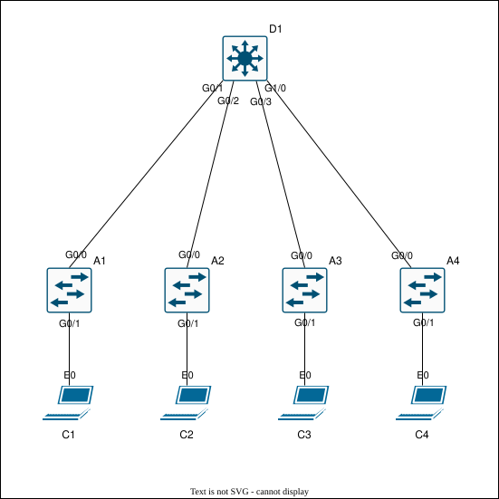

# Lab Guide — SVI Inter-VLAN Routing

## Overview

This lab demonstrates how to configure and verify inter-VLAN routing using switched virtual interfaces on a Layer 3 switch.

SVIs allow a multilayer switch to provide Layer 3 gateway services for multiple VLANs without requiring an external router-on-a-stick design. In this lab, D1 acts as the distribution switch, provides the default gateway for VLANs 10, 20, 30, and 40, and routes traffic between those VLANs.

This lab validates VLAN creation, SVI gateway configuration, IP routing, trunk configuration, native VLAN consistency, access-port assignment, inter-VLAN routing, and end-to-end client connectivity.

**Lab Status:** Validated

**End-to-End Verification:** Successful

---

**CML VLAN Export Note:** Cisco CML topology exports and exported device configuration files may not preserve VLAN database state. VLAN IDs, VLAN names, and intended VLAN design are documented in this README and should not be inferred from "topology.yaml" or exported configs alone.

---

## Objectives

* [x] Configure VLANs 10, 20, 30, 40, and 99.
* [x] Configure SVIs for VLANs 10, 20, 30, and 40.
* [x] Enable Layer 3 routing on the distribution switch.
* [x] Configure trunk links between the distribution and access switches.
* [x] Configure VLAN 99 as the native VLAN on trunk links.
* [x] Configure access ports for client VLANs.
* [x] Verify SVI gateway reachability.
* [x] Verify inter-VLAN client connectivity.
* [x] Verify routed paths with traceroute.
* [x] Capture selected ICMP traffic for packet-level validation.

---

## Topology

The topology uses one Layer 3 distribution switch, four Layer 2 access switches, and four clients. Each access switch connects to D1 using an 802.1Q trunk, and each client is placed in a separate VLAN.



---

## Device Roles

| Device | Role                | Purpose                                      |
| ------ | ------------------- | -------------------------------------------- |
| D1     | Distribution Switch | Provides SVI gateways and inter-VLAN routing |
| A1     | Access Switch       | Provides access for VLAN 10 client           |
| A2     | Access Switch       | Provides access for VLAN 20 client           |
| A3     | Access Switch       | Provides access for VLAN 30 client           |
| A4     | Access Switch       | Provides access for VLAN 40 client           |
| C1     | Client              | VLAN 10 endpoint                             |
| C2     | Client              | VLAN 20 endpoint                             |
| C3     | Client              | VLAN 30 endpoint                             |
| C4     | Client              | VLAN 40 endpoint                             |

---

## Link Tables

### Distribution to Access Links

| Local Device | Local Interface | Peer Device | Peer Interface | Mode  | Description  |
| ------------ | --------------- | ----------- | -------------- | ----- | ------------ |
| D1           | Gi0/1           | A1          | Gi0/0          | Trunk | Uplink to A1 |
| D1           | Gi0/2           | A2          | Gi0/0          | Trunk | Uplink to A2 |
| D1           | Gi0/3           | A3          | Gi0/0          | Trunk | Uplink to A3 |
| D1           | Gi1/0           | A4          | Gi0/0          | Trunk | Uplink to A4 |

### Access Links

| Local Device | Local Interface | Peer Device | Peer Interface | Mode   | VLAN |
| ------------ | --------------- | ----------- | -------------- | ------ | ---- |
| A1           | Gi0/1           | C1          | eth0           | Access | 10   |
| A2           | Gi0/1           | C2          | eth0           | Access | 20   |
| A3           | Gi0/1           | C3          | eth0           | Access | 30   |
| A4           | Gi0/1           | C4          | eth0           | Access | 40   |

---

## VLANs and SVIs

| VLAN | Name      | Subnet          | SVI    | Gateway                |
| ---- | --------- | --------------- | ------ | ---------------------- |
| 10   | USERS_10  | 192.168.10.0/24 | Vlan10 | 192.168.10.1           |
| 20   | USERS_20  | 192.168.20.0/24 | Vlan20 | 192.168.20.1           |
| 30   | USERS_30  | 192.168.30.0/24 | Vlan30 | 192.168.30.1           |
| 40   | USERS_40  | 192.168.40.0/24 | Vlan40 | 192.168.40.1           |
| 99   | NATIVE_99 | N/A             | N/A    | Native VLAN for trunks |

---

## Trunk and Access VLAN Assignment

| Device | Interface | Mode   | VLANs                               |
| ------ | --------- | ------ | ----------------------------------- |
| D1     | Gi0/1     | Trunk  | Allowed: 10,20,30,40,99; Native: 99 |
| D1     | Gi0/2     | Trunk  | Allowed: 10,20,30,40,99; Native: 99 |
| D1     | Gi0/3     | Trunk  | Allowed: 10,20,30,40,99; Native: 99 |
| D1     | Gi1/0     | Trunk  | Allowed: 10,20,30,40,99; Native: 99 |
| A1     | Gi0/0     | Trunk  | Allowed: 10,20,30,40,99; Native: 99 |
| A2     | Gi0/0     | Trunk  | Allowed: 10,20,30,40,99; Native: 99 |
| A3     | Gi0/0     | Trunk  | Allowed: 10,20,30,40,99; Native: 99 |
| A4     | Gi0/0     | Trunk  | Allowed: 10,20,30,40,99; Native: 99 |
| A1     | Gi0/1     | Access | VLAN 10                             |
| A2     | Gi0/1     | Access | VLAN 20                             |
| A3     | Gi0/1     | Access | VLAN 30                             |
| A4     | Gi0/1     | Access | VLAN 40                             |

---

## Configuration Steps

### Step 1 — Distribution Switch Base Configuration

**Note:** The CLI examples below are annotated for readability. Clean device configurations are available in [`configs/`](configs/).

**D1**

```bash
# D1 Base Configuration Block
enable # Enters privileged EXEC mode.
configure terminal # Enters global configuration mode.
hostname D1 # Sets hostname to D1.
no ip domain-lookup # Prevents DNS lookup delays from mistyped commands.

ip routing # Enables Layer 3 routing on the switch.

spanning-tree mode pvst # Enables Cisco PVST mode.
spanning-tree portfast default # Enables PortFast globally for edge ports.
spanning-tree portfast bpduguard default # Enables BPDU Guard globally for PortFast edge ports.

interface gigabitEthernet0/1 # Targets uplink to A1.
no shutdown # Enables the interface.

interface gigabitEthernet0/2 # Targets uplink to A2.
no shutdown # Enables the interface.

interface gigabitEthernet0/3 # Targets uplink to A3.
no shutdown # Enables the interface.

interface gigabitEthernet1/0 # Targets uplink to A4.
no shutdown # Enables the interface.
```

---

### Step 2 — Distribution Switch VLAN and SVI Configuration

**D1**

```bash
# D1 VLAN and SVI Configuration Block
vlan 10 # Creates VLAN 10.
name USERS_10 # Names VLAN 10.

vlan 20 # Creates VLAN 20.
name USERS_20 # Names VLAN 20.

vlan 30 # Creates VLAN 30.
name USERS_30 # Names VLAN 30.

vlan 40 # Creates VLAN 40.
name USERS_40 # Names VLAN 40.

vlan 99 # Creates VLAN 99.
name NATIVE_99 # Names the native VLAN.

interface vlan 10 # Creates and targets SVI 10.
description VLAN 10 Gateway # Describes the SVI.
ip address 192.168.10.1 255.255.255.0 # Sets the VLAN 10 gateway IP.

interface vlan 20 # Creates and targets SVI 20.
description VLAN 20 Gateway # Describes the SVI.
ip address 192.168.20.1 255.255.255.0 # Sets the VLAN 20 gateway IP.

interface vlan 30 # Creates and targets SVI 30.
description VLAN 30 Gateway # Describes the SVI.
ip address 192.168.30.1 255.255.255.0 # Sets the VLAN 30 gateway IP.

interface vlan 40 # Creates and targets SVI 40.
description VLAN 40 Gateway # Describes the SVI.
ip address 192.168.40.1 255.255.255.0 # Sets the VLAN 40 gateway IP.
```

---

### Step 3 — Distribution Switch Trunk Configuration

**Native VLAN note:** VLAN 99 is used as the native VLAN on trunk links. This requires the native VLAN to match on both sides of each trunk.

**D1**

```bash
# D1 Trunk Configuration Block
interface gigabitEthernet0/1 # Targets trunk link to A1.
description Uplink to A1 # Describes the trunk.
switchport trunk encapsulation dot1q # Sets 802.1Q encapsulation.
switchport mode trunk # Sets interface to trunk mode.
switchport trunk native vlan 99 # Sets native VLAN to 99.
switchport trunk allowed vlan 10,20,30,40,99 # Allows required VLANs on the trunk.
no spanning-tree portfast edge # Disables edge behavior on the trunk.
spanning-tree bpduguard disable # Disables BPDU Guard on the trunk.

interface gigabitEthernet0/2 # Targets trunk link to A2.
description Uplink to A2 # Describes the trunk.
switchport trunk encapsulation dot1q # Sets 802.1Q encapsulation.
switchport mode trunk # Sets interface to trunk mode.
switchport trunk native vlan 99 # Sets native VLAN to 99.
switchport trunk allowed vlan 10,20,30,40,99 # Allows required VLANs on the trunk.
no spanning-tree portfast edge # Disables edge behavior on the trunk.
spanning-tree bpduguard disable # Disables BPDU Guard on the trunk.

interface gigabitEthernet0/3 # Targets trunk link to A3.
description Uplink to A3 # Describes the trunk.
switchport trunk encapsulation dot1q # Sets 802.1Q encapsulation.
switchport mode trunk # Sets interface to trunk mode.
switchport trunk native vlan 99 # Sets native VLAN to 99.
switchport trunk allowed vlan 10,20,30,40,99 # Allows required VLANs on the trunk.
no spanning-tree portfast edge # Disables edge behavior on the trunk.
spanning-tree bpduguard disable # Disables BPDU Guard on the trunk.

interface gigabitEthernet1/0 # Targets trunk link to A4.
description Uplink to A4 # Describes the trunk.
switchport trunk encapsulation dot1q # Sets 802.1Q encapsulation.
switchport mode trunk # Sets interface to trunk mode.
switchport trunk native vlan 99 # Sets native VLAN to 99.
switchport trunk allowed vlan 10,20,30,40,99 # Allows required VLANs on the trunk.
no spanning-tree portfast edge # Disables edge behavior on the trunk.
spanning-tree bpduguard disable # Disables BPDU Guard on the trunk.

end # Returns to privileged EXEC mode.
write memory # Saves the running configuration.
```

---

### Step 4 — Access Switch Configuration

**Design note:** Each access switch has the same VLAN database and native VLAN configuration, but each client-facing access port is assigned to a different user VLAN.

**A1**

```bash
# A1 Configuration Block
enable # Enters privileged EXEC mode.
configure terminal # Enters global configuration mode.
hostname A1 # Sets hostname to A1.
no ip domain-lookup # Prevents DNS lookup delays from mistyped commands.

vlan 10 # Creates VLAN 10.
name USERS_10 # Names VLAN 10.

vlan 20 # Creates VLAN 20.
name USERS_20 # Names VLAN 20.

vlan 30 # Creates VLAN 30.
name USERS_30 # Names VLAN 30.

vlan 40 # Creates VLAN 40.
name USERS_40 # Names VLAN 40.

vlan 99 # Creates VLAN 99.
name NATIVE_99 # Names the native VLAN.

interface gigabitEthernet0/1 # Targets client-facing access port for C1.
description Access to C1 # Describes the access port.
switchport mode access # Sets interface to access mode.
switchport access vlan 10 # Assigns the interface to VLAN 10.

interface gigabitEthernet0/0 # Targets trunk link to D1.
description Uplink to D1 # Describes the trunk.
switchport trunk encapsulation dot1q # Sets 802.1Q encapsulation.
switchport mode trunk # Sets interface to trunk mode.
switchport trunk native vlan 99 # Sets native VLAN to 99.
switchport trunk allowed vlan 10,20,30,40,99 # Allows required VLANs on the trunk.
no cdp enable # Disables CDP on this trunk in the captured configuration.
no spanning-tree portfast edge # Disables edge behavior on the trunk.
spanning-tree bpduguard disable # Disables BPDU Guard on the trunk.

end # Returns to privileged EXEC mode.
write memory # Saves the running configuration.
```

**A2**

```bash
# A2 Configuration Block
enable # Enters privileged EXEC mode.
configure terminal # Enters global configuration mode.
hostname A2 # Sets hostname to A2.
no ip domain-lookup # Prevents DNS lookup delays from mistyped commands.

vlan 10 # Creates VLAN 10.
name USERS_10 # Names VLAN 10.

vlan 20 # Creates VLAN 20.
name USERS_20 # Names VLAN 20.

vlan 30 # Creates VLAN 30.
name USERS_30 # Names VLAN 30.

vlan 40 # Creates VLAN 40.
name USERS_40 # Names VLAN 40.

vlan 99 # Creates VLAN 99.
name NATIVE_99 # Names the native VLAN.

interface gigabitEthernet0/1 # Targets client-facing access port for C2.
description Access to C2 # Describes the access port.
switchport mode access # Sets interface to access mode.
switchport access vlan 20 # Assigns the interface to VLAN 20.

interface gigabitEthernet0/0 # Targets trunk link to D1.
description Uplink to D1 # Describes the trunk.
switchport trunk encapsulation dot1q # Sets 802.1Q encapsulation.
switchport mode trunk # Sets interface to trunk mode.
switchport trunk native vlan 99 # Sets native VLAN to 99.
switchport trunk allowed vlan 10,20,30,40,99 # Allows required VLANs on the trunk.
no cdp enable # Disables CDP on this trunk in the captured configuration.
no spanning-tree portfast edge # Disables edge behavior on the trunk.
spanning-tree bpduguard disable # Disables BPDU Guard on the trunk.

end # Returns to privileged EXEC mode.
write memory # Saves the running configuration.
```

**A3**

```bash
# A3 Configuration Block
enable # Enters privileged EXEC mode.
configure terminal # Enters global configuration mode.
hostname A3 # Sets hostname to A3.
no ip domain-lookup # Prevents DNS lookup delays from mistyped commands.

vlan 10 # Creates VLAN 10.
name USERS_10 # Names VLAN 10.

vlan 20 # Creates VLAN 20.
name USERS_20 # Names VLAN 20.

vlan 30 # Creates VLAN 30.
name USERS_30 # Names VLAN 30.

vlan 40 # Creates VLAN 40.
name USERS_40 # Names VLAN 40.

vlan 99 # Creates VLAN 99.
name NATIVE_99 # Names the native VLAN.

interface gigabitEthernet0/1 # Targets client-facing access port for C3.
description Access to C3 # Describes the access port.
switchport mode access # Sets interface to access mode.
switchport access vlan 30 # Assigns the interface to VLAN 30.

interface gigabitEthernet0/0 # Targets trunk link to D1.
description Uplink to D1 # Describes the trunk.
switchport trunk encapsulation dot1q # Sets 802.1Q encapsulation.
switchport mode trunk # Sets interface to trunk mode.
switchport trunk native vlan 99 # Sets native VLAN to 99.
switchport trunk allowed vlan 10,20,30,40,99 # Allows required VLANs on the trunk.
no cdp enable # Disables CDP on this trunk in the captured configuration.
no spanning-tree portfast edge # Disables edge behavior on the trunk.
spanning-tree bpduguard disable # Disables BPDU Guard on the trunk.

end # Returns to privileged EXEC mode.
write memory # Saves the running configuration.
```

**A4**

```bash
# A4 Configuration Block
enable # Enters privileged EXEC mode.
configure terminal # Enters global configuration mode.
hostname A4 # Sets hostname to A4.
no ip domain-lookup # Prevents DNS lookup delays from mistyped commands.

vlan 10 # Creates VLAN 10.
name USERS_10 # Names VLAN 10.

vlan 20 # Creates VLAN 20.
name USERS_20 # Names VLAN 20.

vlan 30 # Creates VLAN 30.
name USERS_30 # Names VLAN 30.

vlan 40 # Creates VLAN 40.
name USERS_40 # Names VLAN 40.

vlan 99 # Creates VLAN 99.
name NATIVE_99 # Names the native VLAN.

interface gigabitEthernet0/1 # Targets client-facing access port for C4.
description Access to C4 # Describes the access port.
switchport mode access # Sets interface to access mode.
switchport access vlan 40 # Assigns the interface to VLAN 40.

interface gigabitEthernet0/0 # Targets trunk link to D1.
description Uplink to D1 # Describes the trunk.
switchport trunk encapsulation dot1q # Sets 802.1Q encapsulation.
switchport mode trunk # Sets interface to trunk mode.
switchport trunk native vlan 99 # Sets native VLAN to 99.
switchport trunk allowed vlan 10,20,30,40,99 # Allows required VLANs on the trunk.
no cdp enable # Disables CDP on this trunk in the captured configuration.
no spanning-tree portfast edge # Disables edge behavior on the trunk.
spanning-tree bpduguard disable # Disables BPDU Guard on the trunk.

end # Returns to privileged EXEC mode.
write memory # Saves the running configuration.
```

---

## Verification

See [`verification/verification_commands.md`](verification/verification_commands.md) for recorded command output.

### D1 Verification

```bash
# D1 Verification Block
show ip interface brief # Confirm SVIs and physical uplinks are in the expected state.
show vlan brief # Confirm VLANs 10, 20, 30, 40, and 99 exist.
show interfaces trunk # Confirm trunks, 802.1Q encapsulation, native VLAN 99, and allowed VLANs.
show spanning-tree vlan 10 # Confirm required ports are forwarding for VLAN 10.
show spanning-tree vlan 20 # Confirm required ports are forwarding for VLAN 20.
show spanning-tree vlan 30 # Confirm required ports are forwarding for VLAN 30.
show spanning-tree vlan 40 # Confirm required ports are forwarding for VLAN 40.
show ip route # Confirm connected routes for all SVI networks.
show running-config interface gigabitEthernet0/1 # Confirm trunk configuration toward A1.
show running-config interface gigabitEthernet0/2 # Confirm trunk configuration toward A2.
show running-config interface gigabitEthernet0/3 # Confirm trunk configuration toward A3.
show running-config interface gigabitEthernet1/0 # Confirm trunk configuration toward A4.
```

**STP note:** This lab validates forwarding state and trunk behavior. It does not intentionally control STP root bridge placement.

### Access Switch Verification

```bash
# Access Switch Verification Block
show ip interface brief # Confirm trunk uplink and client-facing access port are up/up.
show vlan brief # Confirm VLANs exist and the correct access port is assigned.
show interfaces trunk # Confirm trunk status, native VLAN 99, and allowed VLANs.
show spanning-tree vlan <vlan-id> # Confirm required trunk and access ports are forwarding.
show running-config interface gigabitEthernet0/0 # Confirm trunk configuration toward D1.
```

### Connectivity Verification

```bash
# D1 SVI Gateway Verification
ping 192.168.10.1 # Confirm VLAN 10 SVI responds.
ping 192.168.20.1 # Confirm VLAN 20 SVI responds.
ping 192.168.30.1 # Confirm VLAN 30 SVI responds.
ping 192.168.40.1 # Confirm VLAN 40 SVI responds.

# Client to Default Gateway Verification
ping -w 5 192.168.10.1 # From C1, confirm VLAN 10 gateway reachability.
ping -w 5 192.168.20.1 # From C2, confirm VLAN 20 gateway reachability.
ping -w 5 192.168.30.1 # From C3, confirm VLAN 30 gateway reachability.
ping -w 5 192.168.40.1 # From C4, confirm VLAN 40 gateway reachability.

# Inter-VLAN Client Verification
ping -w 5 192.168.20.20 # From C1, confirm inter-VLAN routing to C2.
ping -w 5 192.168.30.30 # From C2, confirm inter-VLAN routing to C3.
ping -w 5 192.168.40.40 # From C3, confirm inter-VLAN routing to C4.
ping -w 5 192.168.20.20 # From C4, confirm inter-VLAN routing to C2.

# Routed Path Verification
traceroute 192.168.20.20 # From C1, confirm path through VLAN 10 gateway.
traceroute 192.168.30.30 # From C2, confirm path through VLAN 20 gateway.
traceroute 192.168.40.40 # From C3, confirm path through VLAN 30 gateway.
traceroute 192.168.20.20 # From C4, confirm path through VLAN 40 gateway.
```

### Packet Captures

The following packet captures provide additional evidence for selected ICMP flows:

| Capture                                                                                         | Description                                 |
| ----------------------------------------------------------------------------------------------- | ------------------------------------------- |
| [`C1_to_10gateway_filtered.pcap`](verification/captures/filtered/C1_to_10gateway_filtered.pcap) | ICMP traffic from C1 to the VLAN 10 gateway |
| [`C1_to_C2_filtered.pcap`](verification/captures/filtered/C1_to_C2_filtered.pcap)               | ICMP traffic from C1 to C2 across VLANs     |

---

## Troubleshooting

**Note:** These are quick-reference checks for this lab. They are not intended to be an exhaustive VLAN, trunking, or SVI troubleshooting guide. After any change, re-run the verification steps to confirm the expected behavior.

```bash
# Client cannot reach its default gateway.
show ip interface brief # Confirm the client-facing access port, trunk, and target SVI are up/up.
show vlan brief # Confirm the client access port is assigned to the correct VLAN.
show interfaces gigabitEthernet0/1 switchport # Confirm the access port is operating in access mode.
show interfaces trunk # Confirm the client VLAN is allowed across the trunk.
show running-config interface vlan <vlan-id> # Confirm SVI gateway IP address.

# Clients cannot reach other VLANs.
show running-config | include ip routing # Confirm Layer 3 routing is enabled.
show ip route # Confirm connected routes exist for all SVI networks.
show ip interface brief # Confirm all required SVIs are up/up.
show arp # Confirm client ARP entries are present where expected.

# Trunk is not passing VLANs.
show interfaces trunk # Confirm trunk status, native VLAN, allowed VLANs, and forwarding VLANs.
show running-config interface gigabitEthernet0/x # Confirm trunk configuration.
show interfaces gigabitEthernet0/x switchport # Confirm operational trunk behavior.
show spanning-tree vlan <vlan-id> # Confirm STP is not blocking a required forwarding path.

# Native VLAN mismatch or inconsistent trunk behavior.
show interfaces trunk # Compare native VLAN values on both sides of the trunk.
show running-config interface gigabitEthernet0/x # Confirm native VLAN configuration.
show spanning-tree inconsistentports # Check for STP inconsistency conditions.
show logging # Review native VLAN mismatch or STP-related messages.

# VLAN exists but SVI is down/down.
show vlan brief # Confirm the VLAN exists and is active.
show interfaces trunk # Confirm at least one active trunk carries the VLAN.
show spanning-tree vlan <vlan-id> # Confirm the VLAN has an active forwarding port.
show ip interface brief # Confirm SVI line protocol state after fixing Layer 2 reachability.
```

---

## Artifacts

| Type            | Location                                                                         |
| --------------- | -------------------------------------------------------------------------------- |
| Configurations  | [`configs/`](configs/)                                                           |
| Diagram         | [`topology/diagram.svg`](topology/diagram.svg)                                   |
| Topology File   | [`topology/topology.yaml`](topology/topology.yaml)                               |
| Verification    | [`verification/verification_commands.md`](verification/verification_commands.md) |
| Packet Captures | [`verification/captures/`](verification/captures/)                               |

---

## Document Metadata

| Field        | Value         |
| ------------ | ------------- |
| Lab Version  | 1.0           |
| Last Updated | 2026-06-28    |
| Author       | Aaron Kindelt |