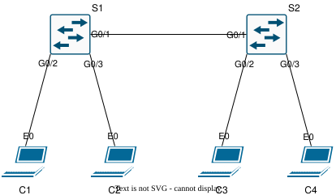

# Lab Guide — VLAN Trunking

## Overview

This lab demonstrates how to configure and verify VLAN trunking between two Layer 2 switches.

VLAN trunking allows multiple VLANs to be carried across a single interswitch link using 802.1Q tagging. In this lab, VLAN 10 and VLAN 20 exist on both switches. Hosts in the same VLAN can communicate across the trunk, while hosts in different VLANs remain isolated because no Layer 3 routing is configured.

This lab validates VLAN creation, access-port assignment, 802.1Q trunk configuration, allowed VLAN behavior, same-VLAN connectivity across switches, and VLAN isolation.

**Lab Status:** Validated

**End-to-End Verification:** Successful

---

## Objectives

* [x] Create and name VLAN 10 and VLAN 20 on both switches.
* [x] Assign access ports to the correct VLANs.
* [x] Configure an 802.1Q trunk between S1 and S2.
* [x] Allow VLANs 10 and 20 across the trunk.
* [x] Enable PortFast and BPDU Guard on client-facing access ports.
* [x] Verify VLAN membership and trunk behavior.
* [x] Verify same-VLAN connectivity across the trunk.
* [x] Verify isolation between VLANs when no Layer 3 routing is configured.
* [x] Capture selected ICMP traffic for packet-level validation.

---

## Topology

The topology uses two Layer 2 switches connected by one trunk link. Each switch has one client in VLAN 10 and one client in VLAN 20.



---

## Addressing Tables

### Switch Links

| Local Device | Local Interface | Peer Device | Peer Interface | Mode   | Description                           |
| ------------ | --------------- | ----------- | -------------- | ------ | ------------------------------------- |
| S1           | Gi0/1           | S2          | Gi0/1          | Trunk  | 802.1Q trunk carrying VLANs 10 and 20 |
| S1           | Gi0/2           | C1          | eth0           | Access | VLAN 10 client                        |
| S1           | Gi0/3           | C2          | eth0           | Access | VLAN 20 client                        |
| S2           | Gi0/1           | S1          | Gi0/1          | Trunk  | 802.1Q trunk carrying VLANs 10 and 20 |
| S2           | Gi0/2           | C3          | eth0           | Access | VLAN 10 client                        |
| S2           | Gi0/3           | C4          | eth0           | Access | VLAN 20 client                        |

### Client Addressing

| Client | Interface | IP Address      | VLAN |
| ------ | --------- | --------------- | ---- |
| C1     | eth0      | 192.168.10.2/24 | 10   |
| C2     | eth0      | 192.168.20.2/24 | 20   |
| C3     | eth0      | 192.168.10.3/24 | 10   |
| C4     | eth0      | 192.168.20.3/24 | 20   |

### VLANs

| VLAN | Name     | Subnet          |
| ---- | -------- | --------------- |
| 10   | USERS_10 | 192.168.10.0/24 |
| 20   | USERS_20 | 192.168.20.0/24 |

---

## Configuration Steps

### Step 1 — VLAN, Access Port, and Trunk Configuration

**Note:** The CLI examples below are annotated for readability. Clean device configurations are available in [`configs/`](configs/).

**Native VLAN note:** The native VLAN is explicitly set to VLAN 1 as a documentation and consistency reminder. VLAN 1 is the Cisco default native VLAN, so it may not appear in the saved running configuration.

**S1**

```bash
# S1 Configuration Block
enable # Enters privileged EXEC mode.
configure terminal # Enters global configuration mode.
hostname S1 # Sets hostname to S1.

vlan 10 # Creates VLAN 10.
name USERS_10 # Names VLAN 10.

vlan 20 # Creates VLAN 20.
name USERS_20 # Names VLAN 20.

interface gigabitEthernet0/2 # Targets client-facing access port for C1.
switchport mode access # Sets interface to access mode.
switchport access vlan 10 # Assigns the interface to VLAN 10.
spanning-tree portfast edge # Enables PortFast edge behavior on the access port.
spanning-tree bpduguard enable # Protects the access port from unexpected BPDUs.

interface gigabitEthernet0/3 # Targets client-facing access port for C2.
switchport mode access # Sets interface to access mode.
switchport access vlan 20 # Assigns the interface to VLAN 20.
spanning-tree portfast edge # Enables PortFast edge behavior on the access port.
spanning-tree bpduguard enable # Protects the access port from unexpected BPDUs.

interface gigabitEthernet0/1 # Targets trunk link to S2.
switchport trunk encapsulation dot1q # Sets 802.1Q trunk encapsulation.
switchport mode trunk # Sets interface to trunk mode.
switchport trunk allowed vlan 10,20 # Allows VLANs 10 and 20 on the trunk.
switchport trunk native vlan 1 # Explicitly documents native VLAN 1.

end # Returns to privileged EXEC mode.
write memory # Saves the running configuration.
```

**S2**

```bash
# S2 Configuration Block
enable # Enters privileged EXEC mode.
configure terminal # Enters global configuration mode.
hostname S2 # Sets hostname to S2.

vlan 10 # Creates VLAN 10.
name USERS_10 # Names VLAN 10.

vlan 20 # Creates VLAN 20.
name USERS_20 # Names VLAN 20.

interface gigabitEthernet0/2 # Targets client-facing access port for C3.
switchport mode access # Sets interface to access mode.
switchport access vlan 10 # Assigns the interface to VLAN 10.
spanning-tree portfast edge # Enables PortFast edge behavior on the access port.
spanning-tree bpduguard enable # Protects the access port from unexpected BPDUs.

interface gigabitEthernet0/3 # Targets client-facing access port for C4.
switchport mode access # Sets interface to access mode.
switchport access vlan 20 # Assigns the interface to VLAN 20.
spanning-tree portfast edge # Enables PortFast edge behavior on the access port.
spanning-tree bpduguard enable # Protects the access port from unexpected BPDUs.

interface gigabitEthernet0/1 # Targets trunk link to S1.
switchport trunk encapsulation dot1q # Sets 802.1Q trunk encapsulation.
switchport mode trunk # Sets interface to trunk mode.
switchport trunk allowed vlan 10,20 # Allows VLANs 10 and 20 on the trunk.
switchport trunk native vlan 1 # Explicitly documents native VLAN 1.

end # Returns to privileged EXEC mode.
write memory # Saves the running configuration.
```

---

## Verification

See [`verification/verification_commands.md`](verification/verification_commands.md) for recorded command output.

### S1 and S2 Verification

```bash
# Switch Verification Block
show ip interface brief # Confirm expected interfaces are up/up.
show vlan brief # Confirm VLAN 10 and VLAN 20 exist and access ports are assigned correctly.
show spanning-tree summary # Confirm VLANs are active and forwarding.
show running-config interface gigabitEthernet0/2 # Confirm VLAN 10 access-port configuration.
show running-config interface gigabitEthernet0/3 # Confirm VLAN 20 access-port configuration.
show running-config interface gigabitEthernet0/1 # Confirm trunk mode and allowed VLANs.
show mac address-table # Confirm client MAC addresses are learned on expected VLANs and interfaces.
show interfaces switchport # Confirm access/trunk modes, VLAN assignments, and 802.1Q behavior.
```

### Client Verification

```bash
# C1 Verification Block
ping 192.168.20.2 # Confirm VLAN 10 cannot reach VLAN 20 without routing.
ping 192.168.10.3 # Confirm VLAN 10 connectivity across the trunk to C3.
ping 192.168.20.3 # Confirm VLAN 10 cannot reach VLAN 20 without routing.

# C2 Verification Block
ping 192.168.10.2 # Confirm VLAN 20 cannot reach VLAN 10 without routing.
ping 192.168.10.3 # Confirm VLAN 20 cannot reach VLAN 10 without routing.
ping 192.168.20.3 # Confirm VLAN 20 connectivity across the trunk to C4.
```

### Packet Captures

The following packet captures provide additional evidence for selected ICMP flows:

| Capture                                                                      | Description                                            |
| ---------------------------------------------------------------------------- | ------------------------------------------------------ |
| [`C1_to_C3_trunk_ping.pcap`](verification/captures/C1_to_C3_trunk_ping.pcap) | ICMP traffic from C1 to C3 across the trunk in VLAN 10 |
| [`C2_to_C4_trunk_ping.pcap`](verification/captures/C2_to_C4_trunk_ping.pcap) | ICMP traffic from C2 to C4 across the trunk in VLAN 20 |

---

## Troubleshooting

**Note:** These are quick-reference checks for this lab. They are not intended to be an exhaustive VLAN or trunking troubleshooting guide. After any change, re-run the verification steps to confirm the expected behavior.

```bash
# VLANs are missing.
show vlan brief # Confirm VLANs exist and are active on both switches.
show running-config | section vlan # Confirm VLAN creation and naming.

# Same-VLAN hosts cannot communicate across the trunk.
show interfaces trunk # Confirm the trunk is up and VLANs 10 and 20 are allowed.
show running-config interface gigabitEthernet0/1 # Confirm trunk mode and allowed VLAN list.
show vlan brief # Confirm access ports are assigned to the correct VLANs.
show mac address-table dynamic # Confirm remote MAC addresses are learned across the trunk.

# Access ports are in the wrong VLAN.
show vlan brief # Confirm access-port VLAN membership.
show interfaces gigabitEthernet0/x switchport # Confirm operational access mode and access VLAN.
show running-config interface gigabitEthernet0/x # Confirm access-port configuration.

# Different VLANs can communicate unexpectedly.
show ip interface brief # Confirm no Layer 3 SVI or routed interface is providing routing.
show running-config | include ip routing # Confirm IP routing is not enabled.
show running-config | section interface Vlan # Check for unexpected SVI configuration.

# Trunk is not forming correctly.
show interfaces trunk # Confirm operational trunk state, encapsulation, native VLAN, and allowed VLANs.
show interfaces gigabitEthernet0/1 switchport # Confirm operational trunk behavior.
show running-config interface gigabitEthernet0/1 # Confirm trunk configuration.
show spanning-tree vlan 10 # Confirm STP is not blocking the trunk for VLAN 10.
show spanning-tree vlan 20 # Confirm STP is not blocking the trunk for VLAN 20.

# Access port is blocking or err-disabled.
show spanning-tree interface gigabitEthernet0/x detail # Confirm STP state, PortFast, and BPDU Guard behavior.
show interfaces status err-disabled # List err-disabled interfaces.
show logging # Confirm reason for err-disable or link-state changes.
show cdp neighbors # Confirm no unexpected infrastructure device is connected to an access port.
```

---

## Artifacts

| Type            | Location                                                                         |
| --------------- | -------------------------------------------------------------------------------- |
| Configurations  | [`configs/`](configs/)                                                           |
| Diagram         | [`topology/diagram.svg`](topology/diagram.svg)                                   |
| Topology File   | [`topology/topology.yaml`](topology/topology.yaml)                               |
| Verification    | [`verification/verification_commands.md`](verification/verification_commands.md) |
| Packet Captures | [`verification/captures/`](verification/captures/)                               |

---

## Document Metadata

| Field        | Value         |
| ------------ | ------------- |
| Lab Version  | 1.0           |
| Last Updated | 2026-06-28    |
| Author       | Aaron Kindelt |