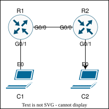

# Lab Guide — P2P Single-Area OSPF

## Overview

This lab demonstrates dynamic routing with single-area OSPF over a point-to-point link.

OSPF allows routers to form neighbor adjacencies, exchange link-state information, and dynamically learn routes to remote networks. In this lab, R1 and R2 form an OSPF adjacency across a `/30` point-to-point link in Area 0. Each router advertises its local LAN into OSPF, allowing client traffic to route between LAN segments.

This lab validates interface addressing, OSPF neighbor formation, point-to-point OSPF network type, passive LAN interfaces, OSPF-learned routes, OSPF database contents, and end-to-end client connectivity.

**Lab Status:** Validated

**End-to-End Verification:** Successful

---

## Objectives

* [x] Configure router interface IP addressing.
* [x] Configure OSPF process ID 1 on R1 and R2.
* [x] Configure unique OSPF router IDs.
* [x] Configure the point-to-point link in OSPF Area 0.
* [x] Configure LAN interfaces as passive OSPF interfaces.
* [x] Verify OSPF neighbor adjacency.
* [x] Verify OSPF point-to-point network type.
* [x] Verify OSPF-learned routes.
* [x] Verify OSPF database contents.
* [x] Verify routed connectivity between LAN segments.
* [x] Capture selected OSPF and ICMP traffic for packet-level validation.

---

## Topology

The topology uses two routers connected by a point-to-point `/30` link. Each router has one directly connected LAN segment with one test client.



---

## Addressing Table

| Device | Interface | IP Address      | Connected To | OSPF Area | Description               |
| ------ | --------- | --------------- | ------------ | --------- | ------------------------- |
| R1     | Gi0/0     | 10.0.0.1/30     | R2 Gi0/0     | 0         | Point-to-point link to R2 |
| R1     | Gi0/1     | 192.168.0.1/24  | C1 eth0      | 0         | R1 LAN gateway            |
| R2     | Gi0/0     | 10.0.0.2/30     | R1 Gi0/0     | 0         | Point-to-point link to R1 |
| R2     | Gi0/1     | 192.168.10.1/24 | C2 eth0      | 0         | R2 LAN gateway            |
| C1     | eth0      | 192.168.0.2/24  | R1 Gi0/1     | N/A       | Test client on R1 LAN     |
| C2     | eth0      | 192.168.10.2/24 | R2 Gi0/1     | N/A       | Test client on R2 LAN     |

---

## OSPF Design Summary

| Device | OSPF Process | Router ID | Transit Network     | LAN Network             | Passive Interface |
| ------ | ------------ | --------- | ------------------- | ----------------------- | ----------------- |
| R1     | 1            | 1.1.1.1   | 10.0.0.0/30, Area 0 | 192.168.0.0/24, Area 0  | Gi0/1             |
| R2     | 1            | 2.2.2.2   | 10.0.0.0/30, Area 0 | 192.168.10.0/24, Area 0 | Gi0/1             |

**Design note:** The LAN interfaces are advertised into OSPF but configured as passive interfaces. This allows the LAN networks to appear in OSPF without sending OSPF hellos toward client devices.

---

## Configuration Steps

### Step 1 — R1 Interface and OSPF Configuration

**Note:** The CLI examples below are annotated for readability. Clean device configurations are available in [`configs/`](configs/).

**R1**

```bash
# R1 Configuration Block
enable # Enters privileged EXEC mode.
configure terminal # Enters global configuration mode.
hostname R1 # Sets hostname to R1.

interface gigabitEthernet0/0 # Targets point-to-point interface to R2.
description P2P to R2 # Adds interface description.
ip address 10.0.0.1 255.255.255.252 # Assigns /30 point-to-point IP address.
ip ospf network point-to-point # Sets OSPF network type to point-to-point.
no shutdown # Enables the interface.

interface gigabitEthernet0/1 # Targets R1 LAN interface.
description R1 LAN # Adds interface description.
ip address 192.168.0.1 255.255.255.0 # Assigns LAN gateway IP address.
no shutdown # Enables the interface.

router ospf 1 # Creates OSPF process 1.
router-id 1.1.1.1 # Sets unique OSPF router ID.
log-adjacency-changes # Logs OSPF neighbor state changes.
passive-interface gigabitEthernet0/1 # Suppresses OSPF hellos on the LAN interface.
network 10.0.0.0 0.0.0.3 area 0 # Advertises point-to-point link in Area 0.
network 192.168.0.0 0.0.0.255 area 0 # Advertises R1 LAN in Area 0.

end # Returns to privileged EXEC mode.
write memory # Saves the running configuration.
```

---

### Step 2 — R2 Interface and OSPF Configuration

**R2**

```bash
# R2 Configuration Block
enable # Enters privileged EXEC mode.
configure terminal # Enters global configuration mode.
hostname R2 # Sets hostname to R2.

interface gigabitEthernet0/0 # Targets point-to-point interface to R1.
description P2P to R1 # Adds interface description.
ip address 10.0.0.2 255.255.255.252 # Assigns /30 point-to-point IP address.
ip ospf network point-to-point # Sets OSPF network type to point-to-point.
no shutdown # Enables the interface.

interface gigabitEthernet0/1 # Targets R2 LAN interface.
description R2 LAN # Adds interface description.
ip address 192.168.10.1 255.255.255.0 # Assigns LAN gateway IP address.
no shutdown # Enables the interface.

router ospf 1 # Creates OSPF process 1.
router-id 2.2.2.2 # Sets unique OSPF router ID.
log-adjacency-changes # Logs OSPF neighbor state changes.
passive-interface gigabitEthernet0/1 # Suppresses OSPF hellos on the LAN interface.
network 10.0.0.0 0.0.0.3 area 0 # Advertises point-to-point link in Area 0.
network 192.168.10.0 0.0.0.255 area 0 # Advertises R2 LAN in Area 0.

end # Returns to privileged EXEC mode.
write memory # Saves the running configuration.
```

---

## Verification

See [`verification/verification_commands.md`](verification/verification_commands.md) for recorded command output.

### R1 and R2 Verification

```bash
# OSPF Verification Block
show ip interface brief # Confirm interfaces are up/up with expected IP addresses.
show ip ospf neighbor # Confirm OSPF neighbor state is FULL.
show ip ospf interface gigabitEthernet0/0 # Confirm Area 0, point-to-point network type, and 10/40 timers.
show ip route ospf # Confirm the remote LAN is learned through OSPF.
show ip ospf database # Confirm both router LSAs are present in Area 0.
show run | section ospf # Confirm OSPF process, router ID, passive interface, and network statements.
show ip protocols # Confirm OSPF process, router ID, advertised networks, passive interface, and routing source.
```

### Routed Path Verification

```bash
# R1 Verification Block
ping 192.168.10.1 source 192.168.0.1 repeat 5 # Confirm R1 can reach R2 LAN gateway using R1 LAN source.
traceroute 192.168.10.1 source 192.168.0.1 # Confirm path from R1 LAN source to R2 LAN gateway.

# R2 Verification Block
ping 192.168.0.1 source 192.168.10.1 repeat 5 # Confirm R2 can reach R1 LAN gateway using R2 LAN source.
traceroute 192.168.0.1 source 192.168.10.1 # Confirm path from R2 LAN source to R1 LAN gateway.
```

### Client Verification

```bash
# C1 Verification Block
ping -w 5 192.168.10.2 # Confirm C1 can reach C2 across the OSPF-learned path.
```

### Packet Captures

The following packet captures provide additional evidence for selected OSPF and ICMP flows:

| Capture                                                          | Description                                             |
| ---------------------------------------------------------------- | ------------------------------------------------------- |
| [`C1_to_C2_ping.pcap`](verification/captures/C1_to_C2_ping.pcap) | ICMP traffic from C1 to C2 across the routed OSPF path  |
| [`R1_to_R2_ospf.pcap`](verification/captures/R1_to_R2_ospf.pcap) | OSPF communication across the R1-R2 point-to-point link |

---

## Troubleshooting

**Note:** These are quick-reference checks for this lab. They are not intended to be an exhaustive OSPF troubleshooting guide. After any change, re-run the verification steps to confirm the expected behavior.

```bash
# OSPF neighbors do not form.
show ip ospf neighbor # Confirm neighbor state.
show ip interface brief # Confirm both point-to-point interfaces are up/up.
show ip ospf interface gigabitEthernet0/0 # Confirm area, network type, timers, and interface participation.
show running-config | section ospf # Confirm network statements and passive-interface configuration.
show ip protocols # Confirm OSPF process and router ID.

# OSPF neighbor is stuck in 2-WAY, EXSTART, or EXCHANGE.
show ip ospf interface gigabitEthernet0/0 # Confirm point-to-point network type and 10/40 timers.
show interfaces gigabitEthernet0/0 # Confirm MTU and interface health.
show ip ospf # Confirm unique router IDs.
show running-config interface gigabitEthernet0/0 # Confirm OSPF network type and IP addressing.

# OSPF routes do not appear.
show ip route ospf # Confirm OSPF-learned routes.
show ip ospf database # Confirm LSAs are present.
show run | section ospf # Confirm LAN network statements are present.
show ip ospf interface gigabitEthernet0/1 # Confirm LAN interface is advertised into OSPF.

# End-to-end connectivity fails.
show ip route # Confirm remote LAN route exists.
show ip route ospf # Confirm OSPF installed the remote LAN route.
ping 10.0.0.2 source 10.0.0.1 # From R1, confirm point-to-point reachability.
ping 10.0.0.1 source 10.0.0.2 # From R2, confirm point-to-point reachability.
ping 192.168.10.1 source 192.168.0.1 # From R1, confirm routed reachability to R2 LAN gateway.
ping 192.168.0.1 source 192.168.10.1 # From R2, confirm routed reachability to R1 LAN gateway.

# OSPF route flapping or intermittent connectivity.
show ip ospf neighbor # Check whether neighbor state is stable.
show logging # Review OSPF adjacency and interface state-change messages.
show interfaces gigabitEthernet0/0 # Confirm no physical errors or link instability.
```

---

## Artifacts

| Type            | Location                                                                         |
| --------------- | -------------------------------------------------------------------------------- |
| Configurations  | [`configs/`](configs/)                                                           |
| Diagram         | [`topology/diagram.svg`](topology/diagram.svg)                                   |
| Topology File   | [`topology/topology.yaml`](topology/topology.yaml)                               |
| Verification    | [`verification/verification_commands.md`](verification/verification_commands.md) |
| Packet Captures | [`verification/captures/`](verification/captures/)                               |

---

## Document Metadata

| Field        | Value         |
| ------------ | ------------- |
| Lab Version  | 1.0           |
| Last Updated | 2026-06-28    |
| Author       | Aaron Kindelt |
