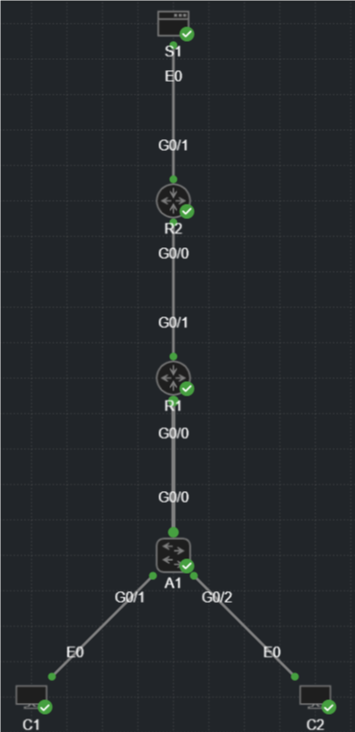

# Lab Guide — Extended ACL

## Overview

This lab demonstrates how to configure and verify an extended IPv4 Access Control List.

Extended ACLs can filter traffic based on source IP, destination IP, protocol, and port. In this lab, R1 filters traffic from an inside LAN toward an outside server. TCP traffic from the inside LAN to the outside server on port `8080` is permitted. All other IP traffic is denied and logged.

The ACL is applied inbound on R1’s inside LAN interface. This places the filter close to the traffic source before traffic crosses the WAN link.

**Lab Status:** Validated

**End-to-End Verification:** Successful

---

## Objectives

* [x] Configure router interface IP addressing.
* [x] Configure an extended named ACL.
* [x] Permit TCP traffic from the inside LAN to a specific outside host on port `8080`.
* [x] Deny and log all other IP traffic.
* [x] Apply the ACL to the correct interface and direction.
* [x] Configure routing between inside and outside networks.
* [x] Validate permitted TCP traffic using a netcat listener.
* [x] Validate denied ICMP traffic using ACL counters and log messages.
* [x] Verify ACL placement using interface inspection.

---

## Topology

The topology uses an inside LAN, a customer edge router, an ISP router, and an outside server network.



---

## Network Summary

| Network         | Purpose                                   |
| --------------- | ----------------------------------------- |
| 192.168.10.0/24 | Inside LAN                                |
| 198.51.100.0/30 | WAN point-to-point link between R1 and R2 |
| 203.0.113.0/24  | Outside server network                    |

---

## Addressing Table

| Device | Interface | IP Address       | Connected To | Description                             |
| ------ | --------- | ---------------- | ------------ | --------------------------------------- |
| R1     | Gi0/0     | 192.168.10.1/24  | A1 Gi0/0     | Inside LAN gateway                      |
| R1     | Gi0/1     | 198.51.100.2/30  | R2 Gi0/0     | WAN link to ISP                         |
| R2     | Gi0/0     | 198.51.100.1/30  | R1 Gi0/1     | WAN link to customer                    |
| R2     | Gi0/1     | 203.0.113.1/24   | S1 eth0      | Outside network gateway                 |
| A1     | Gi0/0     | N/A              | R1 Gi0/0     | Uplink to R1                            |
| A1     | Gi0/1     | N/A              | C1 eth0      | Access port to C1                       |
| A1     | Gi0/2     | N/A              | C2 eth0      | Access port to C2                       |
| C1     | eth0      | 192.168.10.10/24 | A1 Gi0/1     | Inside client                           |
| C2     | eth0      | 192.168.10.20/24 | A1 Gi0/2     | Inside client used for denied ICMP test |
| S1     | eth0      | 203.0.113.100/24 | R2 Gi0/1     | Outside server                          |

---

## ACL Policy

| Rule | Action     | Protocol | Source          | Destination   | Port | Purpose                                      |
| ---- | ---------- | -------- | --------------- | ------------- | ---- | -------------------------------------------- |
| 10   | Permit     | TCP      | 192.168.10.0/24 | 203.0.113.100 | 8080 | Allow inside clients to reach S1 on TCP/8080 |
| 20   | Deny + Log | IP       | Any             | Any           | Any  | Block and log all other traffic              |

**Design note:** The ACL permits traffic by source network, destination host, protocol, and destination port. It does not permit all traffic from C1 specifically. Any host in `192.168.10.0/24` can match the permit statement if the destination is `203.0.113.100` on TCP port `8080`.

---

## Configuration Steps

### Step 1 — R1 Interface, Routing, and ACL Configuration

**Note:** The CLI examples below are annotated for readability. Clean device configurations are available in [`configs/`](configs/).

**R1**

```bash
# R1 Extended ACL Configuration
enable # Enters privileged EXEC mode.
configure terminal # Enters global configuration mode.
hostname R1 # Sets hostname to R1.

ip access-list extended EXT_OUTBOUND_FILTER # Creates named extended ACL.
permit tcp 192.168.10.0 0.0.0.255 host 203.0.113.100 eq 8080 # Permits inside LAN traffic to S1 on TCP/8080.
deny ip any any log # Denies and logs all other IP traffic.

interface gigabitEthernet0/0 # Targets inside LAN interface.
description INSIDE_LAN to A1 # Adds interface description.
ip address 192.168.10.1 255.255.255.0 # Assigns inside LAN gateway address.
ip access-group EXT_OUTBOUND_FILTER in # Applies ACL inbound from the inside LAN.
no shutdown # Enables the interface.

interface gigabitEthernet0/1 # Targets WAN interface to R2.
description OUTSIDE_WAN to R2 # Adds interface description.
ip address 198.51.100.2 255.255.255.252 # Assigns WAN IP address.
no shutdown # Enables the interface.

ip route 0.0.0.0 0.0.0.0 198.51.100.1 # Configures default route toward R2.

end # Returns to privileged EXEC mode.
write memory # Saves the running configuration.
```

---

### Step 2 — R2 Interface and Return Route Configuration

**R2**

```bash
# R2 Routing Configuration
enable # Enters privileged EXEC mode.
configure terminal # Enters global configuration mode.
hostname R2 # Sets hostname to R2.

interface gigabitEthernet0/0 # Targets WAN interface to R1.
description CUSTOMER_WAN to R1 # Adds interface description.
ip address 198.51.100.1 255.255.255.252 # Assigns WAN IP address.
no shutdown # Enables the interface.

interface gigabitEthernet0/1 # Targets outside server network interface.
description OUTSIDE_GATEWAY # Adds interface description.
ip address 203.0.113.1 255.255.255.0 # Assigns outside network gateway address.
no shutdown # Enables the interface.

ip route 192.168.10.0 255.255.255.0 198.51.100.2 # Configures return route to inside LAN through R1.

end # Returns to privileged EXEC mode.
write memory # Saves the running configuration.
```

---

### Step 3 — A1 Access Switch Configuration

**A1**

```bash
# A1 Basic Access Switch Configuration
enable # Enters privileged EXEC mode.
configure terminal # Enters global configuration mode.
hostname A1 # Sets hostname to A1.

interface gigabitEthernet0/0 # Targets uplink to R1.
description Uplink to R1 # Adds interface description.
no shutdown # Enables the interface.

interface gigabitEthernet0/1 # Targets access port to C1.
description Access to C1 # Adds interface description.
no shutdown # Enables the interface.

interface gigabitEthernet0/2 # Targets access port to C2.
description Access to C2 # Adds interface description.
no shutdown # Enables the interface.

end # Returns to privileged EXEC mode.
write memory # Saves the running configuration.
```

---

### Step 4 — S1 Netcat Listener

**S1**

```bash
busybox nc -l -p 8080 # Starts a listener on TCP port 8080.
```

---

## Verification

See [`verification/verification_commands.md`](verification/verification_commands.md) for recorded command output.

### R1 ACL Verification

```bash
show ip access-lists EXT_OUTBOUND_FILTER # Confirm ACL entries and match counters.
show ip interface gigabitEthernet0/0 # Confirm ACL is applied inbound on the inside interface.
show ip route # Confirm R1 has a default route toward R2.
```

### Permitted TCP/8080 Test

```bash
# Run on S1 first.
busybox nc -l -p 8080 # Start TCP listener on S1.

# Run on C1.
echo HTTP Traffic Confirmed | nc 203.0.113.100 8080 # Send TCP/8080 payload to S1.
```

### Denied ICMP Test

```bash
# Run on C2.
ping -w 5 203.0.113.100 # Confirm ICMP to S1 is denied by the ACL.

# Run on R1.
show ip access-lists EXT_OUTBOUND_FILTER # Confirm deny counter increments.
```

---

## Troubleshooting

**Note:** These are quick-reference checks for this lab. They are not intended to be an exhaustive ACL troubleshooting guide. After any change, re-run the verification steps to confirm the expected behavior.

```bash
# Permitted TCP/8080 traffic fails.
show ip access-lists EXT_OUTBOUND_FILTER # Confirm permit statement exists and counter increments.
show ip interface gigabitEthernet0/0 # Confirm ACL is applied inbound on the inside interface.
show running-config | section ip access-list extended EXT_OUTBOUND_FILTER # Confirm ACL syntax.
show ip route # Confirm default route exists on R1.
ping 198.51.100.1 source 198.51.100.2 # Confirm R1 can reach R2 across WAN.

# ACL hit counter does not increment.
show ip interface gigabitEthernet0/0 # Confirm ACL name and direction.
show running-config interface gigabitEthernet0/0 # Confirm ip access-group command.
show running-config | include access-group # Confirm where ACLs are applied.
show ip access-lists EXT_OUTBOUND_FILTER # Confirm traffic is matching expected ACL entries.

# Non-TCP/8080 traffic succeeds unexpectedly.
show ip access-lists EXT_OUTBOUND_FILTER # Confirm explicit deny statement exists.
show running-config | section ip access-list extended EXT_OUTBOUND_FILTER # Confirm ACL order.
show ip interface gigabitEthernet0/0 # Confirm inbound ACL is applied to the correct interface.
show running-config | include ip access-group # Confirm no wrong or misspelled ACL name is applied.

# TCP/8080 is permitted, but no response is returned.
show ip access-lists EXT_OUTBOUND_FILTER # Confirm permit counter increments.
show ip route 203.0.113.100 # Confirm R1 route toward outside host.
show ip route 192.168.10.0 # Confirm R2 return route toward inside LAN.
show ip interface gigabitEthernet0/1 # Confirm no unexpected ACL blocks return traffic on R1 WAN.
show ip interface gigabitEthernet0/0 # Confirm no outbound ACL blocks return traffic toward inside LAN.

# Deny logging is noisy or unexpected.
show logging # Review ACL deny log messages.
show ip access-lists EXT_OUTBOUND_FILTER # Review which ACL entries are matching.
show running-config | section ip access-list extended EXT_OUTBOUND_FILTER # Confirm whether deny logging is intentionally enabled.

# Client-side tests fail.
ip addr # On Linux clients, confirm IP address.
ip route # On Linux clients, confirm default gateway.
ping 192.168.10.1 # Confirm client can reach local gateway.
nc -vz 203.0.113.100 8080 # Test TCP connection to S1 port 8080.
```

---

## Artifacts

| Type            | Location                                                                         |
| --------------- | -------------------------------------------------------------------------------- |
| Configurations  | [`configs/`](configs/)                                                           |
| Diagram         | [`topology/diagram.svg`](topology/diagram.svg)                                   |
| Topology File   | [`topology/topology.yaml`](topology/topology.yaml)                               |
| Verification    | [`verification/verification_commands.md`](verification/verification_commands.md) |
| Packet Captures | [`verification/captures/`](verification/captures/)                               |

---

## Document Metadata

| Field        | Value         |
| ------------ | ------------- |
| Lab Version  | 1.0           |
| Last Updated | 2026-06-28    |
| Author       | Aaron Kindelt |
