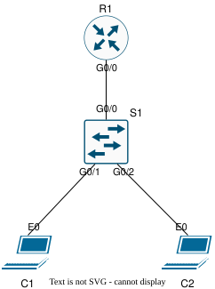

# Lab Guide — Basic DHCP

## Overview

This lab demonstrates how to configure and verify DHCP services on a Cisco router.

DHCP automatically assigns IP addressing information to clients, including an IP address, subnet mask, default gateway, and DNS server. In this lab, R1 provides DHCP services for two VLANs using router-on-a-stick subinterfaces. VLAN 10 and VLAN 20 each receive their own DHCP pool, default gateway, and excluded address range.

This lab validates DHCP exclusions, DHCP pools, client address assignment, dynamic client addressing, and inter-VLAN connectivity using DHCP-assigned addresses.

**Lab Status:** Validated

**End-to-End Verification:** Successful

---

## Objectives

* [x] Configure router-on-a-stick subinterfaces.
* [x] Configure DHCP excluded address ranges.
* [x] Configure DHCP pools for VLAN 10 and VLAN 20.
* [x] Assign default gateway and DNS server information through DHCP.
* [x] Configure switch VLANs, trunk, and access ports.
* [x] Verify DHCP bindings on the router.
* [x] Verify DHCP pool usage.
* [x] Verify client IP assignment.
* [x] Verify inter-VLAN connectivity between DHCP clients.
* [x] Capture selected DHCP traffic for packet-level validation.

---

## Topology

The topology uses one router, one switch, and two clients. R1 provides router-on-a-stick inter-VLAN routing and DHCP services for VLAN 10 and VLAN 20.



---

## VLAN and Gateway Summary

| VLAN | Subnet          | Router Subinterface | Default Gateway |
| ---- | --------------- | ------------------- | --------------- |
| 10   | 192.168.10.0/24 | Gi0/0.10            | 192.168.10.1    |
| 20   | 192.168.20.0/24 | Gi0/0.20            | 192.168.20.1    |

---

## Device and Interface Table

| Device | Interface | IP Address      | Connected To | Description                   |
| ------ | --------- | --------------- | ------------ | ----------------------------- |
| R1     | Gi0/0     | None            | S1 Gi0/0     | Router-on-a-stick trunk to S1 |
| R1     | Gi0/0.10  | 192.168.10.1/24 | VLAN 10      | VLAN 10 default gateway       |
| R1     | Gi0/0.20  | 192.168.20.1/24 | VLAN 20      | VLAN 20 default gateway       |
| S1     | Gi0/0     | Trunk           | R1 Gi0/0     | Trunk to R1                   |
| S1     | Gi0/1     | Access VLAN 10  | C1 eth0      | Access port for C1            |
| S1     | Gi0/2     | Access VLAN 20  | C2 eth0      | Access port for C2            |
| C1     | eth0      | DHCP            | S1 Gi0/1     | VLAN 10 DHCP client           |
| C2     | eth0      | DHCP            | S1 Gi0/2     | VLAN 20 DHCP client           |

---

## DHCP Addressing

| VLAN | Subnet          | Default Gateway | DHCP Pool | Excluded Addresses           |
| ---- | --------------- | --------------- | --------- | ---------------------------- |
| 10   | 192.168.10.0/24 | 192.168.10.1    | VLAN10    | 192.168.10.1 - 192.168.10.20 |
| 20   | 192.168.20.0/24 | 192.168.20.1    | VLAN20    | 192.168.20.1 - 192.168.20.20 |

**Design note:** The DHCP pools define the full subnet, and the excluded-address commands reserve `.1` through `.20` in each subnet. This prevents DHCP from assigning gateway addresses or other reserved static addresses.

---

## Configuration Steps

### Step 1 — R1 Router-on-a-Stick and DHCP Configuration

**Note:** The CLI examples below are annotated for readability. Clean device configurations are available in [`configs/`](configs/).

**R1**

```bash
# R1 DHCP and Router-on-a-Stick Configuration
enable # Enters privileged EXEC mode.
configure terminal # Enters global configuration mode.
hostname R1 # Sets hostname to R1.

interface gigabitEthernet0/0 # Targets physical trunk interface to S1.
description Trunk to S1 # Adds interface description.
no shutdown # Enables the physical interface.

interface gigabitEthernet0/0.10 # Creates VLAN 10 subinterface.
description VLAN10 Gateway # Adds subinterface description.
encapsulation dot1Q 10 # Tags traffic for VLAN 10.
ip address 192.168.10.1 255.255.255.0 # Assigns VLAN 10 gateway address.

interface gigabitEthernet0/0.20 # Creates VLAN 20 subinterface.
description VLAN20 Gateway # Adds subinterface description.
encapsulation dot1Q 20 # Tags traffic for VLAN 20.
ip address 192.168.20.1 255.255.255.0 # Assigns VLAN 20 gateway address.

ip dhcp excluded-address 192.168.10.1 192.168.10.20 # Reserves static addresses in VLAN 10.
ip dhcp excluded-address 192.168.20.1 192.168.20.20 # Reserves static addresses in VLAN 20.

ip dhcp pool VLAN10 # Creates DHCP pool for VLAN 10.
network 192.168.10.0 255.255.255.0 # Defines VLAN 10 DHCP network.
default-router 192.168.10.1 # Provides VLAN 10 default gateway.
dns-server 1.1.1.1 # Provides DNS server for VLAN 10 clients.

ip dhcp pool VLAN20 # Creates DHCP pool for VLAN 20.
network 192.168.20.0 255.255.255.0 # Defines VLAN 20 DHCP network.
default-router 192.168.20.1 # Provides VLAN 20 default gateway.
dns-server 1.1.1.1 # Provides DNS server for VLAN 20 clients.

end # Returns to privileged EXEC mode.
write memory # Saves the running configuration.
```

---

### Step 2 — S1 VLAN, Trunk, and Access Port Configuration

**S1**

```bash
# S1 VLAN and Access Configuration
enable # Enters privileged EXEC mode.
configure terminal # Enters global configuration mode.
hostname S1 # Sets hostname to S1.

vlan 10 # Creates VLAN 10.
name VLAN10_CLIENTS # Names VLAN 10.

vlan 20 # Creates VLAN 20.
name VLAN20_CLIENTS # Names VLAN 20.

interface gigabitEthernet0/0 # Targets trunk link to R1.
description Trunk to R1 # Adds interface description.
switchport mode trunk # Configures interface as a trunk.
switchport trunk allowed vlan 10,20 # Allows VLAN 10 and VLAN 20 on the trunk.
no shutdown # Enables the interface.

interface gigabitEthernet0/1 # Targets access port for C1.
description Access to C1 # Adds interface description.
switchport mode access # Configures interface as an access port.
switchport access vlan 10 # Places C1 in VLAN 10.
no shutdown # Enables the interface.

interface gigabitEthernet0/2 # Targets access port for C2.
description Access to C2 # Adds interface description.
switchport mode access # Configures interface as an access port.
switchport access vlan 20 # Places C2 in VLAN 20.
no shutdown # Enables the interface.

end # Returns to privileged EXEC mode.
write memory # Saves the running configuration.
```

---

## Verification

See [`verification/verification_commands.md`](verification/verification_commands.md) for recorded command output.

### R1 DHCP Verification

```bash
show ip dhcp binding # Confirm DHCP bindings for VLAN 10 and VLAN 20 clients.
show ip dhcp pool # Confirm pool utilization and leased addresses.
show running-config | include dhcp # Confirm DHCP exclusions and pools are configured.
```

### Client Verification

```bash
# Run on C1.
ip a # Confirm C1 receives a dynamic address from 192.168.10.0/24.
ping -w 5 192.168.20.22 # Confirm C1 can reach C2 using DHCP-assigned addresses.

# Run on C2.
ip a # Confirm C2 receives a dynamic address from 192.168.20.0/24.
ping -w 5 192.168.10.22 # Confirm C2 can reach C1 using DHCP-assigned addresses.
```

---

## Troubleshooting

**Note:** These are quick-reference checks for this lab. They are not intended to be an exhaustive DHCP troubleshooting guide. After any change, re-run the verification steps to confirm the expected behavior.

```bash
# Client does not receive a DHCP address.
show ip dhcp binding # Check whether a lease exists for the client.
show ip dhcp pool # Confirm the pool exists and has available addresses.
show running-config | include dhcp # Confirm DHCP configuration exists.
show running-config | include excluded-address # Confirm excluded ranges are correct.
show ip interface brief # Confirm router subinterfaces are up/up.

# Client receives an address from the wrong subnet.
show ip dhcp binding # Confirm which pool issued the address.
show running-config | section ip dhcp pool # Confirm pool network statements.
show vlan brief # On S1, confirm access port VLAN assignment.
show interfaces trunk # On S1, confirm VLANs are allowed on the trunk.

# Client receives an address but cannot reach another VLAN.
ip route # On the client, confirm default gateway exists.
show running-config | section ip dhcp pool # Confirm default-router is configured in the correct pool.
show ip interface brief # Confirm R1 subinterfaces are up/up.
show interfaces trunk # Confirm VLAN 10 and VLAN 20 are crossing the trunk.
ping 192.168.10.1 # From VLAN 10 client, test local gateway.
ping 192.168.20.1 # From VLAN 20 client, test local gateway.

# DHCP pool appears correct but no leases are issued.
show ip dhcp server statistics # Check DHCP server activity.
debug ip dhcp server events # Use carefully to observe DHCP events in real time.
undebug all # Stop debugging.
show mac address-table # On S1, confirm client MAC addresses are learned on expected ports.
```

---

## Artifacts

| Type            | Location                                                                         |
| --------------- | -------------------------------------------------------------------------------- |
| Configurations  | [`configs/`](configs/)                                                           |
| Diagram         | [`topology/diagram.svg`](topology/diagram.svg)                                   |
| Topology File   | [`topology/topology.yaml`](topology/topology.yaml)                               |
| Verification    | [`verification/verification_commands.md`](verification/verification_commands.md) |
| Packet Captures | [`verification/captures/`](verification/captures/)                               |

---

## Document Metadata

| Field        | Value         |
| ------------ | ------------- |
| Lab Version  | 1.0           |
| Last Updated | 2026-06-28    |
| Author       | Aaron Kindelt |
